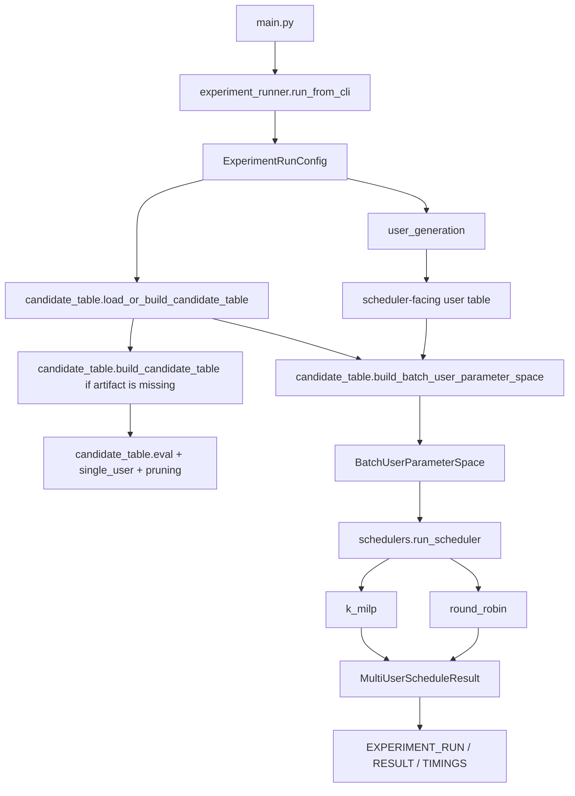

# Master's Thesis Codebase: Joint Scheduling and Resource Allocation for PA Energy Optimization in Multi-PA 5G NR Downlink Systems

This repository contains the cleaned source artifact for the thesis model. It studies how finite-frame downlink scheduling and resource allocation can reduce PA DC energy consumption in a multi-PA 5G NR base station.

The code models the path from generated user demand to scheduler output:

1. Build or load a distance-binned single-user candidate table.
2. Generate one finite-frame user population.
3. Look up each user's feasible single-user operating points.
4. Dispatch the joint scheduling problem to the selected scheduler backend.
5. Report the solved or infeasible frame result.

The main runnable path is `python main.py`, which delegates to `src/experiment_runner`.

## Repository Layout

- `src/configs`: shared radio assumptions, PA catalog loading, user-table columns, and scheduler solver policy.
- `src/models`: shared value objects for radio, deployment, PA, user, candidate-table, and scheduler results.
- `src/user_generation`: deterministic finite-frame user population generation.
- `src/candidate_table`: single-user candidate evaluation, pruning, stored candidate-table loading/building, and user lookup.
- `src/schedulers`: public scheduler dispatch plus the round-robin and K-MILP backends.
- `src/experiment_runner`: official run entry point for one finite-frame experiment case; also contains historical scheduler-comparison campaign contracts.
- `src/thesis_analysis`: post-run processing for completed scheduler-comparison artifacts.
- `notebooks`: thesis discussion notebooks and notebook helper modules.
- `docs`: supporting model notes.
- `scripts/thesis`: thin scripts for extracting and preprocessing the completed scheduler-comparison ZIP.
- `data`: small source/provenance inputs.
- `outputs`: generated outputs; only selected final artifacts are tracked.
- `PA models/3.5Ghz_pas`: measured PA CSV inputs used by the model.

The source boundary contract is documented in [`src/ARCHITECTURE.md`](src/ARCHITECTURE.md).

## How The Main Run Works



`experiment_runner` is the only official runtime entry point. It calls into the lower-level modules; the lower-level modules do not call back into it.

The retained `experiment_runner.scheduler_comparison` submodule defines the historical campaign grid, point IDs, chunk grouping, and manifest columns used by the completed scheduler-comparison artifact. It is a campaign contract, not the main single-case runtime path.

## Environment

The repository does not currently include a lockfile or pinned requirements file. The cleaned workspace has been run with Python 3.11.

Minimal local setup:

```powershell
python -m venv .venv
. .venv\Scripts\Activate.ps1
python -m pip install --upgrade pip
python -m pip install numpy pandas scipy matplotlib ipython jupyter
```

For direct imports from a shell, set:

```powershell
$env:PYTHONPATH = "src"
```

`python main.py` bootstraps `src/` itself, so it does not require `PYTHONPATH`.

## Running A Single Case

Default smoke run:

```powershell
python main.py
```

Explicit K-MILP case:

```powershell
python main.py --scheduler-mode k_milp --active-user-count 15 --load-factor 0.4 --distance-m 250
```

Explicit round-robin case:

```powershell
python main.py --scheduler-mode round_robin --active-user-count 15 --load-factor 0.4 --distance-m 250
```

The output is a compact three-line summary:

- `EXPERIMENT_RUN`: scheduler, algorithm, PA policy, user count, load, and distance.
- `EXPERIMENT_RESULT`: feasibility, active slots, allocation count, and power/energy summary.
- `EXPERIMENT_TIMINGS`: candidate-table, user-generation, lookup, scheduler, and total runtime.

Supported scheduler modes are:

- `k_milp`
- `round_robin`

Supported PA switch policies are:

- `dual_switchable`
- `hard_off`
- `baseline_8w_only`

## Candidate Table

The candidate table is the stored single-user frontier used by scheduler lookup.

Tracked artifact:

```text
outputs/distance_binned_candidate_table.json
```

Public entry points:

- `candidate_table.load_candidate_table`
- `candidate_table.load_or_build_candidate_table`
- `candidate_table.build_candidate_table`
- `candidate_table.build_candidate_frontier_for_distance`
- `candidate_table.build_batch_user_parameter_space`

If the tracked artifact is missing, `load_or_build_candidate_table` rebuilds it.

Parallel rebuild smoke:

```powershell
$env:PYTHONPATH = "src"
python -c "from candidate_table import build_candidate_table; from candidate_table.models import DISTANCE_BIN_GRID_M; table = build_candidate_table(max_workers=2); assert tuple(sorted(table.frontiers_by_distance_m)) == tuple(DISTANCE_BIN_GRID_M); print(f'parallel candidate bins ok bins={len(table.frontiers_by_distance_m)}')"
```

## Scheduler Backends

The public dispatch function is:

```python
from schedulers import run_scheduler
```

Backends:

- `schedulers.round_robin`: deterministic OFDMA round-robin baseline.
- `schedulers.k_milp`: final K-MILP backend with internal K1/K2 implementation stages.

Call the public dispatch path for normal use. Backend internals are kept available for notebooks and focused inspection, but they are not the main orchestration API.

## Tracked Inputs And Artifacts

Tracked source/provenance inputs:

- `data/half_load_curve.csv`
- `PA models/3.5Ghz_pas/*.csv`

Tracked generated/final artifacts:

- `outputs/distance_binned_candidate_table.json`
- `outputs/scheduler_comparison_hpc_sweep.zip`

Everything else under `outputs/` is ignored by default. The two tracked files above are explicit exceptions in `.gitignore`.

The completed scheduler-comparison ZIP is the collected HPC campaign artifact. Raw HPC XML submissions and expanded local extraction folders are not tracked.

## Post-Run Processing

Post-run processing lives in `src/thesis_analysis`.

Extract the scheduler-comparison ZIP:

```powershell
python scripts\thesis\extract_scheduler_comparison_artifact.py
```

This extracts to:

```text
outputs/scheduler_comparison_hpc_sweep_extracted
```

Build local derived CSVs and summaries:

```powershell
python scripts\thesis\preprocess_scheduler_comparison.py
```

This writes ignored derived outputs under:

```text
data/scheduler_comparison_hpc_sweep_analysis
```

Those derived tables are rebuildable from `outputs/scheduler_comparison_hpc_sweep.zip`.

## Notebooks And Docs

The notebooks are discussion artifacts. They show the model stages, examples, and thesis-facing walkthroughs:

1. `notebooks/1. Scenario definition and problem framing discussion.ipynb`
2. `notebooks/2. User generation discussion.ipynb`
3. `notebooks/3. Candidate evaluation discussion.ipynb`
4. `notebooks/4. Candidate space discussion.ipynb`
5. `notebooks/5. tdma scheduling discussion.ipynb`
6. `notebooks/6. OFDMA scheduling discussion.ipynb`

The docs folder currently contains the 5G NR resource hierarchy note used by the model explanation.

## Validation Notes

The final project artifact does not track a test suite. Validation for the recent cleanup was done before tests were removed from the tracked final repository.

Useful smoke checks for local changes:

```powershell
python main.py --scheduler-mode k_milp --active-user-count 15 --load-factor 0.4 --distance-m 250
```

```powershell
$env:PYTHONPATH = "src"
python -c "from experiment_runner import build_experiment_run_config, run_experiment_case; print('experiment runner imports ok')"
```

```powershell
$env:PYTHONPATH = "src"
python -c "from candidate_table import build_candidate_table; table = build_candidate_table(max_workers=2); print(f'parallel candidate bins ok bins={len(table.frontiers_by_distance_m)}')"
```

## Reading Order

For source orientation:

1. [`src/ARCHITECTURE.md`](src/ARCHITECTURE.md)
2. `main.py`
3. `src/experiment_runner`
4. `src/user_generation`
5. `src/candidate_table`
6. `src/schedulers`
7. `src/thesis_analysis`
