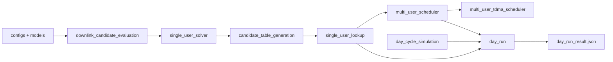

# **I am updating the git this weekend 26.06.2026, most of the code and docs currently here is about 2 months old**

# Master's Thesis Codebase: Joint Scheduling and Resource Allocation for PA Energy Optimization in Multi-PA 5G NR Downlink Systems 

The goal of this project is to study how downlink scheduling and PHY resource allocation can be used to reduce PA DC energy consumption in a multi-PA 5G NR base station. The implementation follows 3GPP-compliant assumptions and focuses on PDSCH transmission. It models link adaptation, PRB allocation, and PA operating behaviour, and shows how scheduler decisions map to PA operating points and overall energy use.

This README is meant to help a reader find their way around the repository and identify the main code paths. It stays fairly technical on purpose. For worked examples and the step-by-step flow of the code, the best place to start is the notebooks. For the model logic and narrative explanation, see `docs/`. 

## Current status

The current implementation uses a TDMA scheduler to prove feasibility. Ongoing work is extending this to a full OFDMA scheduler to better reflect real scheduling conditions.

The current model follows the following logic:

1. It evaluates feasible single-user PHY operating points for a user at a given distance and rate target.
2. It stores those single-user results in a distance-binned lookup table.
3. It builds per-user feasible menus from that table and solves the joint TDMA schedule across users.
4. It can generate a synthetic day of demand and run the full pipeline bin by bin, exporting one JSON result.

The source layout and package ownership are defined in [`src/ARCHITECTURE.md`](src/ARCHITECTURE.md). That file should be treated as the boundary contract for `src/`.

## Where to read more

If you want the full walkthrough rather than just the technical entry points:

- `notebooks/` shows examples, intermediate outputs, and the actual flow used in the thesis work.
- `docs/` explains the model logic, the narrative, and the reasoning behind the code structure.

A good rule of thumb is:

- use the README to find the code,
- use the notebooks to see how it runs,
- use the docs to understand why it is built this way.

## Repository map

- `src/configs`: shared defaults, scenario presets, PA catalog loading, and scheduler table contracts
- `src/models`: shared value objects and radio-state helpers
- `src/downlink_candidate_evaluation`: SINR, rate, and power feasibility per candidate
- `src/single_user_solver`: single-user problem setup and candidate enumeration or search
- `src/candidate_table_generation`: build, load, save, and prune the distance-binned candidate table
- `src/single_user_lookup`: user normalization and lookup into the precomputed table
- `src/multi_user_scheduler`: shared scheduler dispatch and mode selection
- `src/multi_user_tdma_scheduler`: TDMA problem setup, pruning, and joint search
- `src/day_cycle_simulation`: synthetic demand generation
- `src/day_run`: full-day orchestration and JSON export
- `src/run_reporting.py`: shared logging helpers
- `src/experiment_runner`: thesis campaign definitions, point ordering, chunking, and run-manifest contracts
- `notebooks`: thesis notebooks for the scenario, demand generation, candidate spaces, TDMA scheduling, and results
- `docs`: model explanation and project narrative
- `data`: shared load curves and stored candidate-table artifacts
- `PA models`: measured PA CSV inputs
- `results`: archived example outputs
- `outputs`: generated outputs from current runs
- `tests`: contract and structure tests

## How the code runs



The main flow is:

1. `configs` defines the radio assumptions, user-table contract, day-cycle presets, and PA source paths.
2. `models` provides shared data structures and radio-state helpers.
3. `single_user_solver` prepares one user problem and evaluates feasible active candidates.
4. `candidate_table_generation` stores a pruned frontier over fixed distance bins.
5. `single_user_lookup` maps each user to the nearest supported distance bin and filters the table by required rate.
6. `multi_user_scheduler` selects the concrete scheduler backend behind a shared public contract.
7. `multi_user_tdma_scheduler` currently provides the implemented backend and solves the joint TDMA schedule.
8. `day_cycle_simulation` can generate a full day of demand.
9. `day_run` runs the full pipeline and writes the JSON export.

For a full worked walk through of this flow, see the notebooks. The notebooks are the clearest way to follow the steps in order.

## Environment and setup

The repository does not yet ship with a pinned `pyproject.toml`, `requirements.txt`, or environment file. The current workspace runs on Python 3.11, and the tests use `pytest`.

A simple local setup from the repository root is:

```powershell
python -m venv .venv
. .venv\Scripts\Activate.ps1
python -m pip install --upgrade pip
python -m pip install numpy pandas matplotlib ipython jupyter pytest
```

Notes:

- `main.py` bootstraps `src/`, so `python main.py ...` works without an editable install.
- Tests also bootstrap `src/` through `tests/conftest.py`.
- For manual imports from a shell or REPL, set `PYTHONPATH` to `src` first:

```powershell
$env:PYTHONPATH = "src"
```

## Testing

Run the full test suite from the repository root:

```powershell
pytest
```

The tests cover:

- public package entry points and contracts
- structure and package-boundary rules
- day-run CLI and export behavior
- notebook helper modules

## Main entry points

The code is split into layers rather than one large application.

### Single-user candidate evaluation

Use `single_user_solver` when you want to prepare one fixed-distance problem and evaluate feasible active candidates.

Key entry points:

- `single_user_solver.problem_factory.prepare_single_user_problem`
- `single_user_solver.enumerate_active_candidates`
- `single_user_solver.search_candidates`

### Precomputed candidate table

Use `candidate_table_generation` when you want the stored distance-binned frontier used by the scheduler lookup layer.

Key entry points:

- `candidate_table_generation.build_distance_binned_candidate_table`
- `candidate_table_generation.load_distance_binned_candidate_table`
- `candidate_table_generation.load_or_build_distance_binned_candidate_table`

Default artifact path:

- `data/distance_binned_candidate_table.json`

If the artifact is missing, the load-or-build path creates it automatically.

### Multi-user TDMA scheduling

Use the lookup layer and the scheduler when you already have a table of user requirements.

Scheduler-facing user-table contract:

- `user_id`
- `distance_m`
- `required_rate_bps`

Key entry points:

- `single_user_lookup.build_batch_user_parameter_space`
- `multi_user_scheduler.run_multi_user_scheduler`
- `multi_user_tdma_scheduler.run_multi_user_tdma_scheduler`
- `multi_user_tdma_scheduler.prepare_joint_schedule_problem`

`prepare_joint_schedule_problem` is the advanced TDMA-specific staged entry point used by notebooks and tests. The usual orchestration path should call the one-step scheduler runner instead.

### Full synthetic day run

`main.py` is thin. It bootstraps `src/` and delegates to `day_run.run_from_cli`.

Example:

```powershell
python main.py --switch-policy dual_switchable --cores 8 --log-level INFO
```

Supported switch policies are currently:

- `dual_switchable`
- `hard_off`
- `baseline_8w_only`

The default day-run path:

- builds a synthetic day-wide demand table from `data/half_load_curve.csv`
- ensures the distance-binned candidate table exists
- solves each simulation bin independently
- writes one JSON artifact under `outputs/default_day_run_<policy>/day_run_result.json`

This is the heaviest run path in the repository. For understanding the model, the notebooks are the better starting point.

## Inputs and artifacts

Important repository-local inputs:

- `data/half_load_curve.csv`: default load curve for synthetic day generation
- `data/distance_binned_candidate_table.json`: stored single-user frontier table used by the lookup layer
- `data/scheduler_comparison_hpc_sweep.zip`: canonical compressed scheduler-comparison result artifact
- `PA models/3.5Ghz_pas/4W_8W_NR_combined_NR_carrier_with_idle.csv`: default measured PA source used by the shared radio config

Generated outputs are local by default:

- `outputs/`: new day-run exports written by the current code path; ignored by Git

Archived `results/` folders are not part of the cleaned thesis artifact. Rebuild fresh outputs from the current code path when result snapshots are needed.

The main export for a completed full-day run is one JSON file:

- `day_run_result.json`

The scheduler-comparison thesis results are stored as chunked high-performance-computing outputs inside `data/scheduler_comparison_hpc_sweep.zip`. The raw XML submission files are not part of the cleaned artifact. Conceptually, each HPC chunk runs a bounded slice of the scheduler comparison campaign; the ZIP is the canonical collected artifact from those chunk runs. Derived CSVs, manifests, and figures are rebuildable from that ZIP and are kept out of Git unless they are later promoted as final thesis evidence.

The runner-side campaign contract lives in `experiment_runner.scheduler_comparison`: it defines the historical scheduler-comparison point grid, stable point IDs, exact-scenario load-chain ordering, chunk selection, and manifest columns used by the collected ZIP. Current post-run workflow:

1. To change scenarios or recompute campaign outputs, rerun the scheduler-comparison campaign first. The cleaned artifact currently tracks the completed ZIP, not the raw HPC XML submissions.
2. To extract the canonical ZIP locally, run `python scripts\thesis\extract_scheduler_comparison_artifact.py`. This writes the large extracted tree under ignored `outputs/scheduler_comparison_hpc_sweep_extracted/`.
3. To rebuild analysis CSVs and manifests, run `python scripts\thesis\preprocess_scheduler_comparison.py`. This writes ignored derived tables under `data/scheduler_comparison_hpc_sweep_analysis/`, matching the current Results and Observations notebook paths.
4. To inspect or extend analysis, use the Results and Observations notebooks after the notebook audit restores the final notebook set.

## Notebooks

The notebooks are the best place to see the repository used in context. They show the examples, the intermediate outputs, and the flow used in the thesis work.

A useful reading order is:

1. [`notebooks/1. scenario definition and problem framing.ipynb`](notebooks/1.%20scenario%20definition%20and%20problem%20framing.ipynb)
2. [`notebooks/2. User Generation.ipynb`](notebooks/2.%20User%20Generation.ipynb)
3. [`notebooks/3. Candidate Space Discussion.ipynb`](notebooks/3.%20Candidate%20Space%20Discussion.ipynb)
4. [`notebooks/4. tdma scheduling discussion.ipynb`](notebooks/4.%20tdma%20scheduling%20discussion.ipynb)
5. [`notebooks/5. Scenario Results and Discussion.ipynb`](notebooks/5.%20Scenario%20Results%20and%20Discussion.ipynb)

Many of the notebook visuals and helper functions live under `notebooks/helpers/`.

## Conventions

- `src/ARCHITECTURE.md` is the source of truth for package ownership
- public result payloads are kept lean on purpose
- package boundaries are enforced in part by the test suite
- the scheduler-facing user-table contract is kept small and stable

## Scope of this README

This README describes the repository as it exists now. It does not try to retell the full thesis story.

In practice:

- use this file to find the main code paths
- use the notebooks to follow examples and execution flow
- use the docs to follow the model logic and narrative

If you are new to the repository, a good starting path is:

1. `src/ARCHITECTURE.md`
2. `notebooks/`
3. `docs/`
4. `src/configs`
5. `src/models`
6. `src/single_user_solver`
7. `src/single_user_lookup`
8. `src/multi_user_tdma_scheduler`
9. `src/day_run`
