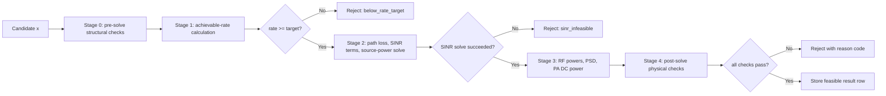

# 1. Scope and contract

This document describes the behavior of the candidate resource allocation evaluation engine implemented in `src/downlink_resource_allocation/single_user_engine.py`.

The engine evaluates one candidate PHY configuration at a time:

$$
x=(\mathrm{PA},\mathrm{BWP},N_{\mathrm{PRB}},N_{\mathrm{slots,on}},L,N_{\mathrm{active,tx}},m)
$$

where:
- $\mathrm{PA}$: selected PA model
- $\mathrm{BWP}$: selected bandwidth-part entry
- $N_{\mathrm{PRB}}$: scheduled PRB count
- $N_{\mathrm{slots,on}}$: number of active slots in the evaluation window
- $L$: layer count
- $N_{\mathrm{active,tx}}$: number of active transmit chains
- $m$: MCS index

The purpose of the engine is to answer one question for a given candidate:

Is this candidate structurally valid, able to meet the required rate when a target rate is given, and physically supportable by the link and PA model?

If the answer is yes, the engine stores the candidate metrics in one result row. If the answer is no, the engine either discards the candidate or, when `include_infeasible=True`, returns an infeasible row with a reason code.

This engine does not optimize over candidates, does not rank schedule efficiency in a larger resource-sharing problem, and does not decide whether a feasible candidate is globally desirable. Its role ends once it has evaluated whether one candidate is possible and what metrics it produces.

## 2. Problem definition used by the engine

The engine evaluates candidates inside a `Problem` object containing:
- `deployment`: physical and link-budget constants
- `pa_catalog`: measured or supplied PA models
- `rrc_catalog`: one BWP/RRC envelope per $(\mathrm{bandwidth},\mathrm{PA})$ pair
- `search_space`: discrete scheduler dimensions
- `options`: execution options

### 2.1 Deployment parameters

`_build_deployment()` constructs the deployment from `link_constants` and `phy_constants`. The current deployment object carries:
- carrier frequency $f_c$
- channel bandwidth
- user distance
- effective path loss
- TX and RX antenna gains
- thermal-noise density
- LNA noise figure
- implementation loss
- mutual-information sample count
- DMRS symbol count
- DFT size
- slot-window length
- slot duration
- data-symbol count and total-symbol count per slot
- PSD-constraint enable flag and PSD limit
- OFDM PAPR
- multiplicative signal factor $g_\phi$
- phase-noise and quantization-noise variances
- total number of TX chains

### 2.2 PA catalog

The engine uses either:
- a supplied `pa_catalog`, or
- a CSV loaded through `build_pa_catalog()`

Each PA entry stores:
- `p_max_w`
- `p_idle_w`
- `eta_max`
- `g_pa_eff_linear`
- `kappa_distortion`
- `backoff_db`
- optional measured `curve_pout_w`, `curve_pdc_w`, and `curve_pin_w`

### 2.3 BWP and RRC envelope catalog

`ResourceGridModel.build_bwp_catalog()` creates one `RRCParams` entry for every bandwidth in `bandwidth_space_hz` and every PA in the PA catalog.

For each entry:

$$
N_{\mathrm{PRB,max,BWP}}=\left\lfloor\frac{B_{\mathrm{BWP}}}{12\Delta f}\right\rfloor
$$

The catalog also stores:
- `bwp_index`
- `bwp_bw_hz`
- `delta_f_hz`
- `prb_max_bwp`
- `max_layers=N_{\mathrm{tx}}`
- `max_mcs=\max(\text{mcs_table})`
- `active_pa_id`

### 2.4 Search space

`ResourceGridModel.build_search_space()` defines the discrete dimensions searched by the engine:
- $N_{\mathrm{slots,on}}\in\{1,\dots,N_{\mathrm{slots,win}}\}$ if not provided explicitly
- `layers_space` from `scheduler_sweep`
- $N_{\mathrm{active,tx}}\in\{1,\dots,N_{\mathrm{tx}}\}$
- `mcs_space` from `scheduler_sweep`
- `prb_step` from `scheduler_sweep` unless overridden

`enumerate_scheduler_candidates()` then generates candidate tuples by looping over:
- every RRC entry
- $N_{\mathrm{PRB}}=1,1+\mathrm{prb\_step},\dots,N_{\mathrm{PRB,max,BWP}}$
- every $N_{\mathrm{slots,on}}$
- every $L$
- every $N_{\mathrm{active,tx}}$
- every $m$

with early structural pruning during enumeration:
- discard if $L<1$ or $L>\mathrm{max\_layers}$
- discard if $N_{\mathrm{active,tx}}<L$ or $N_{\mathrm{active,tx}}>N_{\mathrm{tx}}$
- discard if $m>\mathrm{max\_mcs}$

## 3. Evaluation order

`SingleUserResourceAllocationEngine.evaluate_candidate()` applies the same fixed sequence to every candidate:



First, the engine checks structural validity. Next, it computes achievable rate. Candidates below the target rate are removed before any SINR solve. The link model then solves the minimum required source power. RF and DC power terms are computed only after a valid SINR solution exists. PA-cap and PSD checks are applied only after the RF powers are known. Only then is the candidate stored.

## 4. Stage 0: pre-solve structural feasibility

`evaluate_feasibility(..., stage="pre_solve")` applies the structural checks before any rate or power calculation:
- `rrc_not_found`: no matching $(\mathrm{pa\_id},\mathrm{bwp\_idx})$ entry exists in the RRC catalog
- `invalid_layer_count`: $L<1$ or $L>\mathrm{rrc.max\_layers}$
- `invalid_active_tx_count`: $N_{\mathrm{active,tx}}\le 0$, or $N_{\mathrm{active,tx}}<L$, or $N_{\mathrm{active,tx}}>N_{\mathrm{tx}}$
- `invalid_mcs`: $m>\mathrm{rrc.max\_mcs}$
- `invalid_slot_count`: $N_{\mathrm{slots,on}}<1$ or $N_{\mathrm{slots,on}}>N_{\mathrm{slots,win}}$
- `insufficient_res`: $N_{\mathrm{PRB}}>\mathrm{rrc.prb\_max\_bwp}$

If any of these checks fails, the engine stops immediately for that candidate.

## 5. Stage 1: achievable-rate model

Once the candidate passes the pre-solve checks, the engine converts it to `SchedulerVars`:

$$
s(x)=\left(N_{\mathrm{PRB}},N_{\mathrm{slots,on}},L,N_{\mathrm{active,tx}},m\right)
$$

### 5.1 Slot-level resource-element counts

`slot_level_re_counts()` computes:

$$
N_{\mathrm{RE,raw}}=N_{\mathrm{PRB}}\cdot 12\cdot N_{\mathrm{sym,data}}
$$

$$
N_{\mathrm{DMRS,RE/PRB}}=12\cdot N_{\mathrm{DMRS,sym}}
$$

$$
N_{\mathrm{pilot}}=N_{\mathrm{PRB}}\cdot N_{\mathrm{DMRS,RE/PRB}}
$$

$$
N_{\mathrm{RE,data}}=\max\left(N_{\mathrm{RE,raw}}-N_{\mathrm{pilot}},1\right)
$$

The $\max(\cdot,1)$ term is part of the code and guarantees a strictly positive data-RE count.

$$
\begin{array}{ll}
\hline
\text{Variable}& \text{Meaning} \\
\hline
N_{\mathrm{RE,raw}}& \text{Raw number of resource elements in the scheduled PRBs across the data symbols of one slot.} \\
N_{\mathrm{PRB}}& \text{Number of scheduled physical resource blocks.} \\
N_{\mathrm{sym,data}}& \text{Number of OFDM data symbols per slot that are counted for payload and DMRS placement.} \\
N_{\mathrm{DMRS,RE/PRB}}& \text{Number of DMRS resource elements within one PRB for one slot.} \\
N_{\mathrm{DMRS,sym}}& \text{Number of DMRS OFDM symbols in one slot.} \\
N_{\mathrm{pilot}}& \text{Total number of pilot resource elements in the scheduled PRBs of one slot.} \\
N_{\mathrm{RE,data}}& \text{Number of slot-level resource elements left for payload after pilot removal.} \\
\hline
\end{array}
$$

### 5.2 Occupied bandwidth and time duty cycle

The occupied bandwidth used later by the PSD check is:

$$
B_{\mathrm{occ}}=N_{\mathrm{PRB}}\cdot 12\Delta f
$$

The scheduler time duty cycle is:

$$
\alpha_t=\frac{N_{\mathrm{slots,on}}}{N_{\mathrm{slots,win}}}
$$

The fixed window duration is:

$$
T_{\mathrm{win}}=N_{\mathrm{slots,win}}T_{\mathrm{slot}}
$$

$$
\begin{array}{ll}
\hline
\text{Variable}& \text{Meaning} \\
\hline
B_{\mathrm{occ}}& \text{Occupied bandwidth spanned by the scheduled PRBs.} \\
\Delta f& \text{Subcarrier spacing.} \\
\alpha_t& \text{Fraction of slots in the evaluation window that are active.} \\
N_{\mathrm{slots,on}}& \text{Number of active scheduled slots in the window.} \\
N_{\mathrm{slots,win}}& \text{Total number of slots in the evaluation window.} \\
T_{\mathrm{win}}& \text{Total duration of the fixed evaluation window.} \\
T_{\mathrm{slot}}& \text{Duration of one slot.} \\
\hline
\end{array}
$$

### 5.3 Achievable rate

`compute_rate()` uses the MCS spectral efficiency $\eta(m)$ from `mcs_table`:

$$
b_{\mathrm{slot}}=N_{\mathrm{RE,data}}\cdot \eta(m)\cdot L
$$

$$
b_{\mathrm{win}}=N_{\mathrm{slots,on}}\cdot b_{\mathrm{slot}}
$$

$$
R_{\mathrm{ach}}(x)=\frac{b_{\mathrm{win}}}{T_{\mathrm{win}}}
$$

If `required_rate_bps` is supplied and

$$
R_{\mathrm{ach}}(x)<R_{\mathrm{target}}
$$

the candidate is rejected with `below_rate_target`.

No SINR, RF-power, or PA-power solve is attempted for that candidate.

$$
\begin{array}{ll}
\hline
\text{Variable}& \text{Meaning} \\
\hline
b_{\mathrm{slot}}& \text{Payload bits carried by one active slot.} \\
\eta(m)& \text{Spectral efficiency of the selected MCS index.} \\
m& \text{Selected MCS index.} \\
L& \text{Number of spatial layers.} \\
b_{\mathrm{win}}& \text{Payload bits carried across the full evaluation window.} \\
R_{\mathrm{ach}}(x)& \text{Achievable average rate produced by candidate $x$.} \\
R_{\mathrm{target}}& \text{Required average rate target, when one is supplied.} \\
\hline
\end{array}
$$

## 6. Stage 2: link and propagation model

The link chain is implemented by `PathLossModel`, `McsRequirementModel`, and `SinrChainModel`.

### 6.1 Effective path loss

`PathLossModel.effective_path_loss_db()` supports:
- `fspl`
- `umi_sc_los`
- `umi_sc_nlos`

For free-space path loss:

$$
L_{\mathrm{FSPL}}=32.44+20\log_{10}\left(f_c^{(\mathrm{MHz})}\right)+20\log_{10}\left(d^{(\mathrm{km})}\right)
$$

For UMi street-canyon LOS:

$$
d_{3\mathrm{D}}=\sqrt{d^2+\left(h_{\mathrm{BS}}-h_{\mathrm{UT}}\right)^2}
$$

$$
d_{\mathrm{BP}}=\frac{4h_{\mathrm{BS}}h_{\mathrm{UT}}f_c}{c}
$$

$$
PL_1=32.4+21\log_{10}\left(d_{3\mathrm{D}}\right)+20\log_{10}\left(f_c^{(\mathrm{GHz})}\right)
$$

$$
PL_2=32.4+40\log_{10}\left(d_{3\mathrm{D}}\right)+20\log_{10}\left(f_c^{(\mathrm{GHz})}\right)-9.5\log_{10}\left(d_{\mathrm{BP}}^2+\left(h_{\mathrm{BS}}-h_{\mathrm{UT}}\right)^2\right)
$$

UMi LOS uses $PL_1$ below the breakpoint and $PL_2$ above it.

For UMi NLOS:

$$
PL'_{\mathrm{NLOS}}=35.3\log_{10}\left(d_{3\mathrm{D}}\right)+22.4+21.3\log_{10}\left(f_c^{(\mathrm{GHz})}\right)-0.3\left(h_{\mathrm{UT}}-1.5\right)
$$

$$
PL_{\mathrm{NLOS}}=\max\left(PL_{\mathrm{LOS}},PL'_{\mathrm{NLOS}}\right)
$$

The effective path loss used by the engine is:

$$
L_{\mathrm{path}}=L_{\mathrm{base}}+L_{\mathrm{shadow}}
$$

$$
\begin{array}{ll}
\hline
\text{Variable}& \text{Meaning} \\
\hline
L_{\mathrm{FSPL}}& \text{Free-space path loss in dB.} \\
f_c& \text{Carrier frequency.} \\
d& \text{Horizontal BS--UT separation distance.} \\
d_{3\mathrm{D}}& \text{Three-dimensional BS--UT separation distance.} \\
h_{\mathrm{BS}}& \text{Base-station antenna height.} \\
h_{\mathrm{UT}}& \text{User-terminal antenna height.} \\
d_{\mathrm{BP}}& \text{Breakpoint distance used by the UMi LOS model.} \\
PL_1& \text{UMi LOS path-loss expression below the breakpoint.} \\
PL_2& \text{UMi LOS path-loss expression above the breakpoint.} \\
PL'_{\mathrm{NLOS}}& \text{Raw UMi NLOS path-loss expression before the max rule.} \\
PL_{\mathrm{NLOS}}& \text{Final UMi NLOS path loss.} \\
L_{\mathrm{base}}& \text{Base path-loss term from the selected model.} \\
L_{\mathrm{shadow}}& \text{Shadowing term added to the base path loss.} \\
L_{\mathrm{path}}& \text{Effective path loss used by the engine.} \\
c& \text{Speed of light.} \\
\hline
\end{array}
$$

### 6.2 Large-scale channel gain

`SinrChainModel.channel_gain_linear()` computes:

$$
g_\ell=\frac{10^{G_{\mathrm{tx}}/10}10^{G_{\mathrm{rx}}/10}}{10^{L_{\mathrm{path}}/10}}
$$

$$
\begin{array}{ll}
\hline
\text{Variable}& \text{Meaning} \\
\hline
g_\ell& \text{Large-scale channel gain in linear form.} \\
G_{\mathrm{tx}}& \text{Transmit antenna gain in dB.} \\
G_{\mathrm{rx}}& \text{Receive antenna gain in dB.} \\
L_{\mathrm{path}}& \text{Effective path loss in dB.} \\
\hline
\end{array}
$$

### 6.3 Stream count and beamforming abstraction

The current single-user stream count is:

$$
N_{\mathrm{streams}}=\max(L,1)
$$

The beamforming gain abstraction is:

$$
g_{\mathrm{bf}}=\max\left(\frac{N_{\mathrm{active,tx}}}{N_{\mathrm{streams}}},1\right)
$$

The effective large-scale gain used in the SINR coefficients is:

$$
g_{\ell,\mathrm{eff}}=g_\ell g_{\mathrm{bf}}
$$

$$
\begin{array}{ll}
\hline
\text{Variable}& \text{Meaning} \\
\hline
N_{\mathrm{streams}}& \text{Number of transmitted streams used by the SINR model.} \\
L& \text{Number of spatial layers.} \\
g_{\mathrm{bf}}& \text{Beamforming-gain abstraction used by the engine.} \\
N_{\mathrm{active,tx}}& \text{Number of active transmit chains.} \\
g_{\ell,\mathrm{eff}}& \text{Effective large-scale gain after the beamforming abstraction.} \\
\hline
\end{array}
$$

### 6.4 Required SINR from the selected MCS

`McsRequirementModel` builds an AWGN mutual-information curve for the QAM order implied by the chosen MCS:

$$
M=2^{Q_m}
$$

The code numerically inverts the mutual-information curve to find the SINR needed to support the target spectral efficiency $\eta(m)$:

$$
\rho_{\mathrm{req,MI}}=I_M^{-1}\left(\eta(m)\right)
$$

Implementation loss is then added:

$$
\rho_{\mathrm{req}}=\rho_{\mathrm{req,MI}}\cdot 10^{L_{\mathrm{impl}}/10}
$$

$$
\begin{array}{ll}
\hline
\text{Variable}& \text{Meaning} \\
\hline
M& \text{QAM constellation size implied by the selected MCS.} \\
Q_m& \text{Number of coded bits per modulation symbol.} \\
\rho_{\mathrm{req,MI}}& \text{Required SINR from the mutual-information inversion before implementation loss.} \\
I_M^{-1}(\cdot)& \text{Inverse mutual-information curve for constellation size $M$.} \\
\eta(m)& \text{Spectral efficiency of the selected MCS.} \\
\rho_{\mathrm{req}}& \text{Final required SINR after implementation loss is included.} \\
L_{\mathrm{impl}}& \text{Implementation loss in dB.} \\
\hline
\end{array}
$$

### 6.5 SINR coefficients used by the source-power solve

`build_sinr_terms()` precomputes the terms reused by the solver.

Noise-density conversion:

$$
N_0=10^{(N_{0,\mathrm{dBm/Hz}}-30)/10}
$$

LNA noise factor:

$$
F_{\mathrm{LNA}}=10^{NF_{\mathrm{LNA}}/10}
$$

Per-subcarrier receiver noise:

$$
\sigma_v^2=F_{\mathrm{LNA}}N_0\Delta f
$$

Occupied bandwidth:

$$
B_{\mathrm{occ}}=N_{\mathrm{PRB}}\cdot 12\Delta f
$$

Active RE count used in the estimator model:

$$
K_{\mathrm{active}}=\operatorname{clip}\left(N_{\mathrm{PRB}}\cdot 12,\ 1,\ N_{\mathrm{DFT}}\right)
$$

The effective distortion gain is:

$$
\kappa_{\mathrm{eff}}=\frac{\kappa_{\mathrm{distortion}}}{10^{\mathrm{backoff}_{\mathrm{dB}}/10}}
$$

The solver coefficients are then:

$$
a_{\mathrm{num}}=\frac{g_{\ell,\mathrm{eff}}\,g_{\mathrm{PA}}\,g_\phi}{K_{\mathrm{active}}}
$$

$$
b_{\mathrm{dist}}=\frac{g_{\ell,\mathrm{eff}}\,\kappa_{\mathrm{eff}}}{K_{\mathrm{active}}}
$$

$$
c_{\mathrm{noise}}=\sigma_v^2+\sigma_q^2+\sigma_\phi^2
$$

$$
\begin{array}{ll}
\hline
\text{Variable}& \text{Meaning} \\
\hline
N_0& \text{Thermal-noise density in linear watts per hertz.} \\
N_{0,\mathrm{dBm/Hz}}& \text{Thermal-noise density in dBm/Hz.} \\
F_{\mathrm{LNA}}& \text{LNA noise factor in linear form.} \\
NF_{\mathrm{LNA}}& \text{LNA noise figure in dB.} \\
\sigma_v^2& \text{Per-subcarrier receiver thermal-noise variance.} \\
B_{\mathrm{occ}}& \text{Occupied bandwidth of the scheduled PRBs.} \\
K_{\mathrm{active}}& \text{Active subcarrier count used by the estimator model, clipped by the DFT size.} \\
N_{\mathrm{DFT}}& \text{DFT size used by the OFDM model.} \\
\kappa_{\mathrm{eff}}& \text{Effective PA distortion gain after backoff.} \\
\kappa_{\mathrm{distortion}}& \text{Base PA distortion coefficient.} \\
\mathrm{backoff}_{\mathrm{dB}}& \text{PA backoff in dB.} \\
a_{\mathrm{num}}& \text{Signal coefficient in the SINR numerator.} \\
b_{\mathrm{dist}}& \text{Distortion coefficient in the SINR denominator.} \\
c_{\mathrm{noise}}& \text{Total additive-noise term used by the solver.} \\
g_{\mathrm{PA}}& \text{Effective PA signal gain in linear form.} \\
g_\phi& \text{Multiplicative signal factor used by the model.} \\
\sigma_q^2& \text{Quantization-noise variance.} \\
\sigma_\phi^2& \text{Phase-noise variance.} \\
\hline
\end{array}
$$

### 6.6 Raw SINR, channel-estimation error, and effective SINR

The source-power solve is performed on total source power, but the SINR expression first divides that power equally across streams:

$$
P_{s,\mathrm{stream}}=\frac{P_{s,\mathrm{total}}}{N_{\mathrm{streams}}}
$$

Raw achievable per-stream SINR:

$$
\rho_{\mathrm{ach,raw}}=
\frac{a_{\mathrm{num}}P_{s,\mathrm{stream}}}
{b_{\mathrm{dist}}P_{s,\mathrm{stream}}+c_{\mathrm{noise}}}
$$

The pilot budget used by the estimation model is:

$$
N_{\mathrm{pilot}}=N_{\mathrm{PRB}}\cdot 12\cdot N_{\mathrm{DMRS,sym}}
$$

The channel-estimation error variance is:

$$
\sigma_e^2=\frac{1}{\rho_{\mathrm{ach,raw}}N_{\mathrm{pilot}}}
$$

The effective SINR used for the MCS constraint is:

$$
\rho_{\mathrm{eff}}=\frac{\rho_{\mathrm{ach,raw}}}{1+\rho_{\mathrm{ach,raw}}\sigma_e^2}
$$

$$
\begin{array}{ll}
\hline
\text{Variable}& \text{Meaning} \\
\hline
P_{s,\mathrm{total}}& \text{Total source power before stream splitting.} \\
P_{s,\mathrm{stream}}& \text{Source power assigned to one stream.} \\
\rho_{\mathrm{ach,raw}}& \text{Raw per-stream SINR before channel-estimation loss.} \\
N_{\mathrm{pilot}}& \text{Total number of pilot resource elements used by the estimator model.} \\
\sigma_e^2& \text{Channel-estimation error variance.} \\
\rho_{\mathrm{eff}}& \text{Effective SINR after the estimator penalty is included.} \\
\hline
\end{array}
$$

### 6.7 Minimum required source power

`solve_required_source_power()` solves the smallest total source power satisfying:

$$
\rho_{\mathrm{eff}}\left(P_{s,\mathrm{total}}\right)\ge \rho_{\mathrm{req}}
$$

The code first forms the denominator coefficient:

$$
d=a_{\mathrm{num}}-\rho_{\mathrm{req}}b_{\mathrm{dist}}
$$

If $d\le 0$, the candidate is immediately infeasible and the function returns `None`.

Otherwise the analytic lower bound is:

$$
P_{s,\mathrm{lb}}=\max\left(\frac{\rho_{\mathrm{req}}c_{\mathrm{noise}}}{d},0\right)
$$

The engine evaluates $\rho_{\mathrm{eff}}$ at this lower bound:
- if the lower bound already satisfies the target, it is accepted
- otherwise the code doubles an upper bracket until a feasible point is found or the search exceeds `1e9`
- after bracketing, it performs 80 bisection iterations

If no feasible bracket is found, the candidate is rejected as `sinr_infeasible`.

$$
\begin{array}{ll}
\hline
\text{Variable}& \text{Meaning} \\
\hline
d& \text{Denominator coefficient that determines whether a finite feasible source power can exist.} \\
P_{s,\mathrm{lb}}& \text{Analytic lower bound on the required total source power.} \\
\rho_{\mathrm{eff}}(P_{s,\mathrm{total}})& \text{Effective SINR expressed as a function of total source power.} \\
\rho_{\mathrm{req}}& \text{Required SINR that must be met by the candidate.} \\
\hline
\end{array}
$$

## 7. Stage 3: RF-power and PA-power calculations

Once the source-power solve succeeds, the engine computes RF terms in `_compute_rf_terms()`.

### 7.1 Source power per stream

$$
P_{s,\mathrm{stream}}=\frac{P_{s,\min}}{N_{\mathrm{streams}}}
$$

$$
\begin{array}{ll}
\hline
\text{Variable}& \text{Meaning} \\
\hline
P_{s,\min}& \text{Minimum feasible total source power returned by the solver.} \\
P_{s,\mathrm{stream}}& \text{Source power assigned to one stream during RF-power evaluation.} \\
N_{\mathrm{streams}}& \text{Number of transmitted streams.} \\
\hline
\end{array}
$$

### 7.2 In-band PA distortion power

`sigma_z2()` returns:

$$
P_{\mathrm{dist,stream}}=\kappa_{\mathrm{eff}}P_{s,\mathrm{stream}}
$$

$$
\begin{array}{ll}
\hline
\text{Variable}& \text{Meaning} \\
\hline
P_{\mathrm{dist,stream}}& \text{In-band distortion RF power produced by one stream.} \\
\kappa_{\mathrm{eff}}& \text{Effective PA distortion gain after backoff.} \\
P_{s,\mathrm{stream}}& \text{Source power assigned to one stream.} \\
\hline
\end{array}
$$

### 7.3 Signal RF output power

$$
P_{\mathrm{sig,out,stream}}=g_{\mathrm{PA}}P_{s,\mathrm{stream}}
$$

$$
P_{\mathrm{sig,out,total}}=N_{\mathrm{streams}}P_{\mathrm{sig,out,stream}}
$$

$$
\begin{array}{ll}
\hline
\text{Variable}& \text{Meaning} \\
\hline
P_{\mathrm{sig,out,stream}}& \text{Signal RF output power produced by one stream.} \\
P_{\mathrm{sig,out,total}}& \text{Total signal RF output power summed across all streams.} \\
g_{\mathrm{PA}}& \text{Effective PA signal gain in linear form.} \\
\hline
\end{array}
$$

### 7.4 Total RF output power

$$
P_{\mathrm{dist,total}}=N_{\mathrm{streams}}P_{\mathrm{dist,stream}}
$$

$$
P_{\mathrm{out,total}}=P_{\mathrm{sig,out,total}}+P_{\mathrm{dist,total}}
$$

$$
P_{\mathrm{out,ant}}=\frac{P_{\mathrm{out,total}}}{N_{\mathrm{active,tx}}}
$$

$$
\begin{array}{ll}
\hline
\text{Variable}& \text{Meaning} \\
\hline
P_{\mathrm{dist,total}}& \text{Total in-band distortion RF power across all streams.} \\
P_{\mathrm{out,total}}& \text{Total RF output power, including signal and distortion.} \\
P_{\mathrm{out,ant}}& \text{RF output power per active transmit chain.} \\
N_{\mathrm{active,tx}}& \text{Number of active transmit chains.} \\
\hline
\end{array}
$$

### 7.5 PSD used by the post-solve feasibility check

$$
\mathrm{PSD}=\frac{P_{\mathrm{out,total}}}{B_{\mathrm{occ}}}
$$

$$
\begin{array}{ll}
\hline
\text{Variable}& \text{Meaning} \\
\hline
\mathrm{PSD}& \text{Output power spectral density used by the PSD feasibility check.} \\
P_{\mathrm{out,total}}& \text{Total RF output power.} \\
B_{\mathrm{occ}}& \text{Occupied bandwidth of the scheduled PRBs.} \\
\hline
\end{array}
$$

### 7.6 Instantaneous and average PA DC power

`pa_dc_power()` behaves as follows:
- if $p_{\mathrm{out}}\le 0$, return `p_idle_w`
- if measured PA curves exist, interpolate DC input power versus RF output power
- below the first measured RF-output point, return `p_idle_w`
- without measured curves, use the proxy efficiency model

For the proxy model:

$$
\lambda=\operatorname{clip}\left(\frac{P_{\mathrm{out,ant}}}{P_{\max}},10^{-3},1\right)
$$

$$
\eta(\lambda)=\eta_{\max}\lambda^{1/2}
$$

$$
P_{\mathrm{DC,inst}}=P_{\mathrm{idle}}+\frac{P_{\mathrm{out,ant}}}{\eta(\lambda)}
$$

`average_pa_power()` then computes the average DC draw of one active chain:

$$
P_{\mathrm{DC,avg,active}}=\alpha_t P_{\mathrm{DC,inst}}+\left(1-\alpha_t\right)P_{\mathrm{idle}}
$$

Finally, `_compute_dc_terms()` forms the transmitter total:

$$
P_{\mathrm{DC,avg,total}}
=
N_{\mathrm{active,tx}}P_{\mathrm{DC,avg,active}}
+
\left(N_{\mathrm{tx}}-N_{\mathrm{active,tx}}\right)P_{\mathrm{idle}}
$$

$$
\begin{array}{ll}
\hline
\text{Variable}& \text{Meaning} \\
\hline
\lambda& \text{Output-power loading ratio of one active chain relative to the PA limit.} \\
P_{\max}& \text{Maximum RF output power supported by one PA chain.} \\
\eta(\lambda)& \text{Proxy PA efficiency at loading ratio $\lambda$.} \\
\eta_{\max}& \text{Maximum proxy PA efficiency.} \\
P_{\mathrm{DC,inst}}& \text{Instantaneous DC input power of one active chain.} \\
P_{\mathrm{idle}}& \text{Idle DC power of one PA chain.} \\
P_{\mathrm{DC,avg,active}}& \text{Average DC power of one active chain across the window.} \\
P_{\mathrm{DC,avg,total}}& \text{Total average DC power across all transmitter chains.} \\
N_{\mathrm{tx}}& \text{Total number of transmitter chains in the deployment.} \\
\hline
\end{array}
$$

## 8. Stage 4: post-solve physical feasibility

After RF powers are known, `evaluate_feasibility(..., stage="post_solve")` applies the physical checks.

The exact rejection reasons are:
- `sinr_infeasible`: the source-power solve returned `None`
- `nonphysical_negative_power`: $p_{\mathrm{out,total}}<0$
- `per_chain_pa_cap`: $P_{\mathrm{out,ant}}>\mathrm{pa.p\_max\_w}$
- `interpolation_out_of_range`: measured PA curves exist and $P_{\mathrm{out,ant}}$ exceeds the largest measured RF-output point
- `total_pa_cap`: $P_{\mathrm{out,total}}>N_{\mathrm{active,tx}}\cdot \mathrm{pa.p\_max\_w}$
- `psd_violation`: `use_psd_constraint=True` and $\mathrm{PSD}>\mathrm{psd\_max\_w\_per\_hz}$

Only candidates that pass all of these checks proceed to result storage.

## 9. Stored result rows

### 9.1 Feasible rows

For a feasible candidate, `_assemble_candidate_result()` stores:

```text
distance_m
path_loss_db
pa_id
pa_name
rate_ach_bps
p_dc_avg_total_w
layers
mcs
n_prb
n_slots_on
alpha_f
alpha_t
bandwidth_hz
n_active_tx
p_rf_out_active_w
p_out_total_w
p_sig_out_active_w
p_sig_out_total_w
ps_total_w
gamma_req_lin
gamma_achieved
rho_ach_raw_linear
n_streams
g_bf_linear
sigma_e2
```

with

$$
\alpha_f=\frac{N_{\mathrm{PRB}}}{N_{\mathrm{PRB,max,BWP}}}
$$

When `include_infeasible=True`, feasible rows additionally carry:
- `is_feasible=True`
- `infeasibility_reason="ok"`

Two implementation details are worth stating clearly because this document is meant to match the code exactly.

First, the current feasible row stores `bandwidth_hz` but not `bwp_idx`. Second, in the current single-user implementation, `p_rf_out_active_w` equals `p_out_total_w`, and `p_sig_out_active_w` equals `p_sig_out_total_w`.

### 9.2 Infeasible rows

When `include_infeasible=True`, `_build_infeasible_row()` stores:
- the candidate identifiers
- `is_feasible=False`
- the exact reason code
- `distance_m` and `path_loss_db` when available
- `alpha_f` and `bandwidth_hz` when the RRC entry is known
- `rate_ach_bps` when the rate was already computed before failure
- `NaN` for unavailable solved metrics

### 9.3 Candidate-table evaluation

`evaluate_candidate_table()`:
1. enumerates every candidate
2. evaluates each one in the order above
3. appends any returned row to a DataFrame

`filter_feasible_configurations()` then removes infeasible rows and can optionally reapply the rate threshold.
