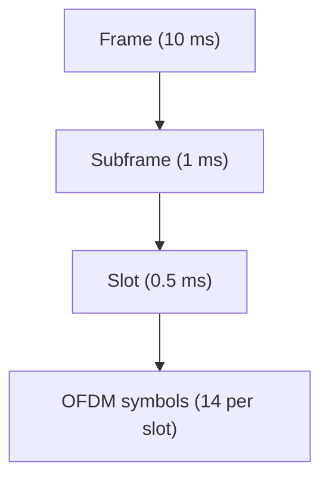
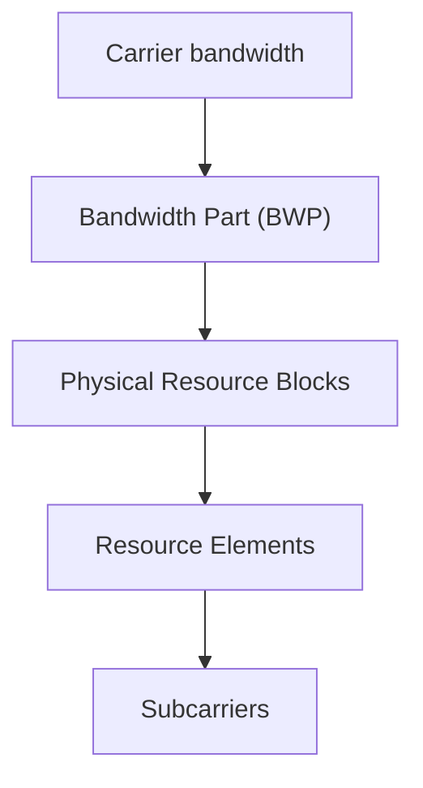

## 1 Scenario grounding

This section summarizes the **time–frequency resource hierarchy used in 5G NR**, focusing on how the physical resource grid defines scheduling granularity and throughput modeling.

The explanation is grounded in a **typical FR1 mid-band deployment**:

- carrier frequency: **3.5 GHz**
    
- frequency range: **FR1**
    
- subcarrier spacing: **30 kHz**
    
- deployment: **micro-cell / small cell**
    
- scheduler granularity: **slot-based scheduling**
    

The system numerology is

$$  
\mu = 1  
$$

which corresponds to

$$  
\Delta f = 30,\mathrm{kHz}  
$$

NR supports multiple OFDM numerologies where the subcarrier spacing is defined as

$$  
\Delta f = 15 \cdot 2^{\mu}\ \text{kHz}  
$$

where:

- $\Delta f$: subcarrier spacing
    
- $\mu$: numerology index
    

This numerology relationship is defined in the NR physical layer specification. \cite{3ggpTS138211V19105G2025}

---
# 2 Time hierarchy

In NR, transmissions are organized in a hierarchical time structure composed of:

- OFDM symbols
- slots
- subframes
- frames

A **radio frame** has duration **10 ms** and is divided into **10 subframes** of **1 ms** each. \cite{3ggpTS138211V19105G2025}

Each slot contains a fixed number of OFDM symbols depending on cyclic prefix configuration.

With **normal cyclic prefix**

- $N_{\mathrm{sym}} = 14$
    
symbols per slot. \cite{3ggpTS138211V19105G2025}

---
## 2.1 Slot duration

The slot duration depends on the numerology and is defined as

$$  
T_{\mathrm{slot}} = \frac{1,\mathrm{ms}}{2^{\mu}}  
$$

where:

- $T_{\mathrm{slot}}$: slot duration
    
- $\mu$: numerology index
    

For the scenario used here:

$$  
\mu = 1  
$$

which gives

$$  
T_{\mathrm{slot}} = 0.5,\mathrm{ms}  
$$

Therefore:

- **2 slots per subframe**
    
- **20 slots per frame**
    

Slots are numbered sequentially within subframes and frames. \cite{3ggpTS138211V19105G2025}

---

## Time hierarchy diagram



For $\mu=1$:

```
1 frame = 10 subframes
1 subframe = 2 slots
1 slot = 14 OFDM symbols
```

---

# 3 Standard UL/DL frame allocations

NR allows **OFDM symbols inside a slot** to be classified as:

- **downlink symbols (D)**
    
- **uplink symbols (U)**
    
- **flexible symbols (F)**
    

These classifications determine whether the symbol carries downlink transmission, uplink transmission, or can dynamically switch direction. \cite{3ggpTS138211V19105G2025}

The specific arrangement of these symbols is called a **slot format**.

Slot formats are defined in **3GPP TS 38.213**, where each slot format is represented by a sequence of **D, U, and F symbols** across the 14 symbols of a slot.

Example slot format:

```
D D D D D D D D D D F F U U
```

where:

- **D**: downlink symbol
    
- **U**: uplink symbol
    
- **F**: flexible symbol
    
Flexible symbols (or flexible slots) in NR are OFDM symbols whose transmission direction is not fixed in the frame structure and may be dynamically assigned as downlink, uplink, or used as transition time by the base station scheduler \cite{3ggpTS138211V19105G2025}. In this model, flexible symbols are treated as guard intervals used for DL–UL switching and are therefore excluded from the usable data resource elements when computing throughput.

A slot format is identified by an SFI (slot format indicator) and can be dynamically signaled by the gNB.
 
## 3.1 Example micro-cell TDD pattern (3.5 GHz)

In many **3.5 GHz NR micro-cell deployments**, the traffic is strongly **downlink-dominated**.

A common scheduling pattern is approximately:

```
DL DL DL DL DL DL DL
DL DL DL DL DL
FLEX
UL UL UL
```

This type of configuration allocates roughly

- **70–80 % downlink capacity**
    
- **10–20 % uplink capacity**
    
- **a few flexible slots**
    

to accommodate scheduling changes.

Flexible symbols inside slots provide guard periods and dynamic direction switching, which is especially useful in dense small-cell deployments.

---

# 4 Frequency hierarchy

In the frequency domain, NR defines resources through the following hierarchy:

- subcarrier
    
- resource element (RE)
    
- physical resource block (PRB)
    
- bandwidth part (BWP)
    
- carrier bandwidth
    

A **resource element (RE)** corresponds to **one subcarrier during one OFDM symbol**, forming the smallest addressable physical resource. \cite{3ggpTS138211V19105G2025}

---

## 4.1 Physical resource blocks

A **physical resource block (PRB)** consists of

- **12 consecutive subcarriers**
    

in frequency.

PRBs span the duration of one slot.

---

## 4.2 Resource elements per slot

The number of resource elements per PRB in one slot is

$$  
N_{\mathrm{RE,slot}} = 12 \cdot N_{\mathrm{sym}}  
$$

where:

- $N_{\mathrm{RE,slot}}$: number of resource elements in one PRB during a slot
    
- $12$: number of subcarriers in a PRB
    
- $N_{\mathrm{sym}}$: number of OFDM symbols per slot
    

With normal cyclic prefix:

$$  
N_{\mathrm{sym}} = 14  
$$

so

$$  
N_{\mathrm{RE,slot}} = 168  
$$

resource elements per PRB before accounting for pilots and control overhead.

---

## Frequency hierarchy diagram



---

# 5 NR resource grid

The NR physical layer is represented as a **two-dimensional time–frequency grid**.

- **time dimension** → OFDM symbols grouped into slots
    
- **frequency dimension** → PRBs composed of subcarriers
    

Each antenna port maintains its own resource grid. \cite{3ggpTS138211V19105G2025}

---

## Resource grid illustration

```
Frequency →
PRBs
│
│
│
└────────────── Time →
        Slots
```

Each **PRB × slot** region contains

$$  
12 \times 14 = 168  
$$

resource elements before overhead.

---

# 6 Throughput modeling

Scheduling assigns a set of PRBs during one or more slots.

The payload bits transmitted during one active slot can be expressed as

$$  
b_{\mathrm{slot}} = N_{\mathrm{RE,data}} \cdot \eta(m) \cdot L  
$$

where:

- $b_{\mathrm{slot}}$: payload-bit count carried by one active slot
    
- $N_{\mathrm{RE,data}}$: usable data resource-element count in one active slot
    
- $\eta(m)$: spectral efficiency of MCS $m$ in bits per resource element per layer
    
- $L$: number of spatial layers
    

This expression links

- **scheduler allocation (PRBs and slots)**
    
- **modulation and coding scheme**
    
- **spatial multiplexing**
    

to the **achievable throughput per scheduling interval**.
''